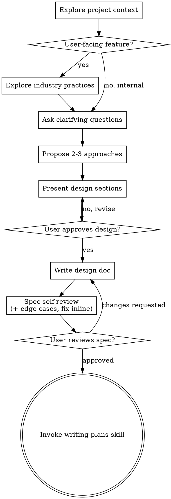

# Brainstorming Ideas Into Designs

Help turn ideas into fully formed designs and specs through natural collaborative dialogue.

Start by understanding the current project context, then ask questions one at a time to refine the idea. Once you understand what you're building, present the design and get user approval.

<HARD-GATE>
Do NOT invoke any implementation skill, write any code, scaffold any project, or take any implementation action until you have presented a design and the user has approved it. This applies to EVERY project regardless of perceived simplicity.
</HARD-GATE>

## Anti-Pattern: "This Is Too Simple To Need A Design"

Every project goes through this process. A todo list, a single-function utility, a config change — all of them. "Simple" projects are where unexamined assumptions cause the most wasted work. The design can be short (a few sentences for truly simple projects), but you MUST present it and get approval.

## Checklist

You MUST create a task for each of these items and complete them in order:

1. **Explore project context** — read project memory first (`docs/pressurecooker/memory/MEMORY.md`; `map` and `convention` memories cover ground you can skip after a cheap staleness spot-check — memories are hints, verify before relying). Then the codebase map if fresh (`docs/pressurecooker/codebase-map/MAP.md`) — read it and explore only what it lacks; for a big feature with no fresh map, run `pressurecooker:analyzing-codebase` before proceeding. Otherwise check files, docs, recent commits, architecture
2. **Explore industry practices** — how does this feature work in the industry: common patterns, popular implementations, best practices. Only for user-facing / product / UX features; skip for internal mechanics (see guard below).
3. **Ask clarifying questions** — one at a time, understand purpose/constraints/success criteria
4. **Propose 2-3 approaches** — with trade-offs and your recommendation, informed by industry practices, feature popularity, and best practices
5. **Present design** — in sections scaled to their complexity, get user approval after each section
6. **Write design doc** — save to `docs/pressurecooker/specs/YYYY-MM-DD-<topic>-design.md` and commit
7. **Spec self-review** — inline check for placeholders, contradictions, ambiguity, scope, edge cases, and surrounding-feature consistency (see below)
8. **User reviews written spec** — ask user to review the spec file before proceeding
9. **Transition to implementation** — invoke writing-plans skill to create implementation plan

## Process Flow

**The terminal state is invoking writing-plans.** Do NOT invoke frontend-design, mcp-builder, or any other implementation skill. The ONLY skill you invoke after brainstorming is writing-plans.

## The Process

**Understanding the idea:**

- Check out the current project state first (files, docs, recent commits)
- If a newly-added folder's role is still ambiguous (sample vs target), `pressurecooker:incoming-folder-triage` should have resolved it before this skill runs. If it didn't, run that triage question now — the answer shapes everything below.
- Before asking detailed questions, assess scope: if the request describes multiple independent subsystems (e.g., "build a platform with chat, file storage, billing, and analytics"), flag this immediately. Don't spend questions refining details of a project that needs to be decomposed first.
- If the project is too large for a single spec, help the user decompose into sub-projects: what are the independent pieces, how do they relate, what order should they be built? Then brainstorm the first sub-project through the normal design flow. Each sub-project gets its own spec → plan → implementation cycle.
- For appropriately-scoped projects, ask questions one at a time to refine the idea
- Prefer multiple choice questions when possible, but open-ended is fine too
- Only one question per message - if a topic needs more exploration, break it into multiple questions
- Focus on understanding: purpose, constraints, success criteria

**Exploring industry practices (user-facing features only):**

- For user-facing, product, or UX features: research how the feature commonly works in the industry — established patterns, popular implementations, and best practices. Feed this into the approaches you propose and the option you recommend.
- **Guard:** Skip industry research for internal mechanics — hooks, config, plumbing, build scripts, this plugin's own internals. There it is noise and fights YAGNI. A feature nobody outside the codebase sees does not need an industry survey.

**Exploring approaches:**

- Propose 2-3 different approaches with trade-offs
- Present options conversationally with your recommendation and reasoning
- Lead with your recommended option and explain why, grounded in industry practices where they apply

**Presenting the design:**

- Once you believe you understand what you're building, present the design
- Scale each section to its complexity: a few sentences if straightforward, up to 200-300 words if nuanced
- Ask after each section whether it looks right so far
- Cover: architecture, components, data flow, error handling, testing
- Be ready to go back and clarify if something doesn't make sense

**Design for isolation and clarity:**

- Break the system into smaller units that each have one clear purpose, communicate through well-defined interfaces, and can be understood and tested independently
- For each unit, you should be able to answer: what does it do, how do you use it, and what does it depend on?
- Can someone understand what a unit does without reading its internals? Can you change the internals without breaking consumers? If not, the boundaries need work.
- Smaller, well-bounded units are also easier for you to work with - you reason better about code you can hold in context at once, and your edits are more reliable when files are focused. When a file grows large, that's often a signal that it's doing too much.

**Working in existing codebases:**

- Explore the current structure before proposing changes. Follow existing patterns.
- KISS (Keep It Simple, Stupid) and TDD (Test-Driven Development) are the goal.
- If an existing pattern is itself the problem, propose refactoring it to best practice — with KISS and TDD in mind.
- **If introducing the feature causes lots of bugs or friction against the current structure, suggest refactoring and extracting the feature into its own module, built with TDD and KISS in mind.** A feature that fights the codebase is a signal the boundary is wrong, not that you should force it in.
- Scope discipline: only refactor the code your work actually touches. Industry-best practice is the bar for that touched code — NOT license for unrelated refactoring. Don't propose changes that don't serve the current goal.

## After the Design

**Documentation:**

- Write the validated design (spec) to `docs/pressurecooker/specs/YYYY-MM-DD-<topic>-design.md`
  - (User preferences for spec location override this default)
- **Write the spec in normal, readable prose — NOT caveman.** The spec is a review artifact; the user-review gate depends on it being clear and complete. Caveman stays for chat, not for the written spec.
- If triage marked any folder **reference-only** (a sample to learn from), the spec MUST include a `Reference-only paths:` line listing them — read for patterns, never modified. writing-plans copies this line into the plan's Global Constraints.
- If the feature touches credentials, tokens, PII, payment or other secure data, the spec MUST include a `Secure-data fields:` line naming those fields/flows (names only, NEVER example values) — writing-plans copies it into Global Constraints and `pressurecooker:secure-data-handling` rules apply to every task touching them.
- If the design surfaced a durable project decision (naming, pattern, boundary), write/update a `convention` memory in `docs/pressurecooker/memory/` (frontmatter `name`/`description`/`type: convention`, normal prose, secure fields by name only) plus its MEMORY.md index line. Update existing memories rather than duplicating; delete ones the design proved wrong.
- If the `elements-of-style` skill is present, use it to tighten the spec's writing. If it is not installed, suggest installing it: https://github.com/obra/the-elements-of-style
- caveman (`caveman@caveman`) is a required dependency of this plugin; if it is somehow missing, suggest installing it.
- Commit the design document to git

**Spec Self-Review:**
After writing the spec document, look at it with fresh eyes:

1. **Placeholder scan:** Any "TBD", "TODO", incomplete sections, or vague requirements? Fix them.
2. **Internal consistency:** Do any sections contradict each other? Does the architecture match the feature descriptions?
3. **Scope check:** Is this focused enough for a single implementation plan, or does it need decomposition?
4. **Ambiguity check:** Could any requirement be interpreted two different ways? If so, pick one and make it explicit.
5. **Edge cases:** Investigate edge cases and how the feature interacts with existing functionality. Inform the user of what you found. Handle the clear ones automatically in the spec; where handling is unclear, ask clarifying questions.
6. **Surrounding-feature consistency:** Does the feature stay consistent and complete with how the surrounding feature/view normally behaves (per industry norms where they apply)? If not, correct the plan.

Fix any issues inline. No need to re-review — just fix and move on.

**User Review Gate:**
After the spec review loop passes, ask the user to review the written spec before proceeding:

> "Spec written and committed to `<path>`. Please review it and let me know if you want to make any changes before we start writing out the implementation plan."

Wait for the user's response. If they request changes, make them and re-run the spec review loop. Only proceed once the user approves.

**Implementation:**

- Invoke the writing-plans skill to create a detailed implementation plan
- Do NOT invoke any other skill. writing-plans is the next step.

## Key Principles

- **One question at a time** - Don't overwhelm with multiple questions
- **Multiple choice preferred** - Easier to answer than open-ended when possible
- **YAGNI ruthlessly** - Remove unnecessary features from all designs
- **Explore alternatives** - Always propose 2-3 approaches before settling, and always recommend one, grounded in industry practices where they apply
- **KISS & TDD** - Keep it simple; drive with tests
- **Incremental validation** - Present design, get approval before moving on
- **Be flexible** - Go back and clarify when something doesn't make sense
